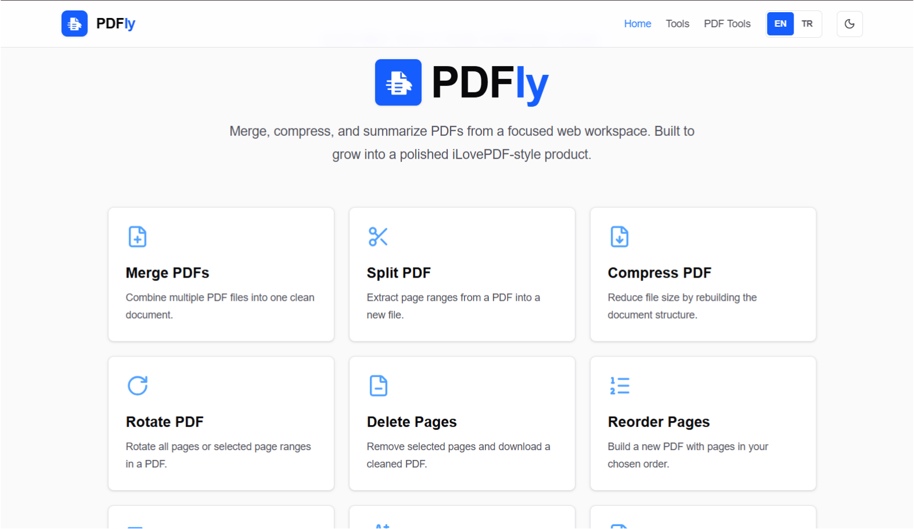

# PDFly

PDFly is a full-stack PDF tools MVP built with Next.js. It brings common PDF workflows into one focused web workspace: merge, split, compress, rotate, reorder, extract text, convert files, and summarize text-based PDFs with AI.

[Live Demo](https://pdfly-tools.vercel.app)



## Highlights

- Practical iLovePDF-style PDF tools in a single app
- Turkish and English language support
- Light and dark mode
- Toast notifications for success, error, and validation states
- File upload validation for PDF, image, and TXT workflows
- Privacy notes for local file processing and AI-powered summaries
- SEO metadata for the homepage, tools catalog, privacy page, and tool routes
- Vercel-ready deployment setup

## Tools

| Category | Tools |
| --- | --- |
| Organize | Merge PDFs, Split PDF, Rotate PDF, Delete Pages, Reorder Pages, Add Page Numbers |
| Convert | PDF to Images, Images to PDF, Extract Text, Text to PDF |
| Optimize | Compress PDF |
| AI | AI Summary |
| Coming soon | Ask PDF, PDF to Word, Word to PDF |

## Tech Stack

- Next.js App Router
- React
- TypeScript
- Tailwind CSS
- pdf-lib
- pdfjs-dist
- pdf2json
- OpenAI API
- lucide-react
- framer-motion

## Getting Started

Install dependencies:

```bash
npm install
```

Create a local environment file:

```bash
cp .env.example .env.local
```


Run the development server:

```bash
npm run dev
```

Open:

```txt
http://localhost:3000
```

## Scripts

```bash
npm run dev
npm run lint
npm run build
npm run start
```


## Privacy Notes

Non-AI PDF tools process uploaded files only for the requested action and do not store files in the application. Generated files are returned directly to the browser. AI Summary is different because extracted PDF text is sent to OpenAI.

See `/privacy` in the app for the user-facing privacy and security summary.

## Deployment

PDFly is ready to deploy on Vercel.

1. Push the repository to GitHub.
2. Import the project in Vercel.
3. Add `OPENAI_API_KEY` in Vercel Environment Variables if AI Summary should be enabled.
4. Deploy.

For a production domain, update `metadataBase` in `app/layout.tsx` from the placeholder URL to the real domain.

## Roadmap

- Ask PDF chat workflow
- OCR for scanned PDFs
- Stronger compression engine
- Batch downloads as ZIP
- Production domain and launch smoke tests
